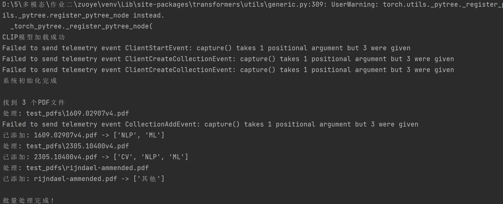
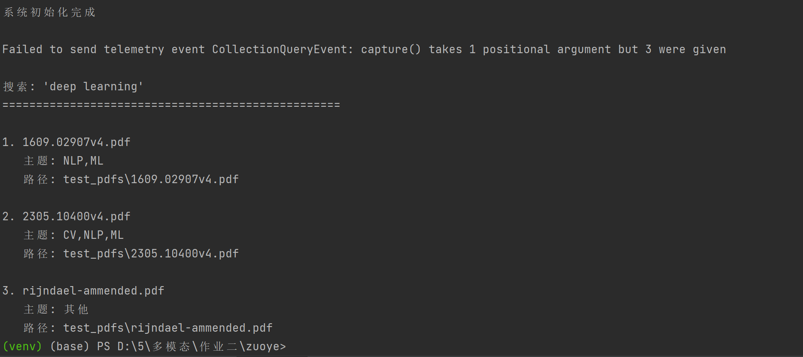
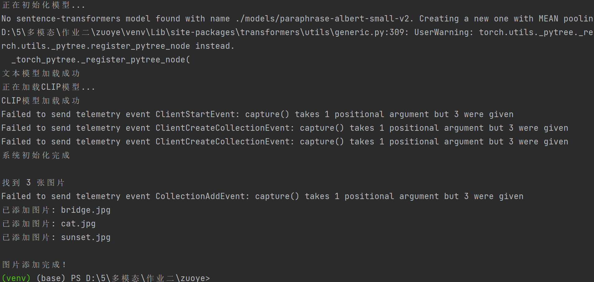
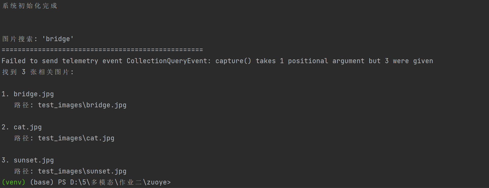

**学号：** 25120396 
**姓名：** 张昕  
**课程：** 多模态机器学习 

---

## 项目简介

本项目是一个基于Python的本地多模态AI智能助手，旨在解决本地大量文献和图像素材管理困难的问题。不同于传统的文件名搜索，本项目利用多模态神经网络技术，实现对内容的**语义搜索**和**自动分类**。

## 核心功能

## 智能文献管理
- **语义搜索**：支持使用自然语言提问（如"Transformer的核心架构是什么？"）
- **自动分类与整理**：
  - 添加新论文时自动分析内容并分类
  - 支持批量整理混乱的PDF文件夹
- **文件索引**：快速定位所需文献

## 智能图像管理
- **以文搜图**：通过自然语言描述（如"海边的日落"）查找匹配图像

---

## 环境配置

## 系统要求
- **操作系统**：Windows / macOS / Linux
- **Python版本**：Python 3.8 及以上
- **内存**：建议 8GB 及以上

## 依赖安装
 pip install -r requirements.txt

## 运行截图（在“运行结果截图”文件夹里）
- 截图1：环境检查
python --version
pip list | findstr "sentence-transformers"
1.png

- 截图2：PDF批量处理
python main.py add test_pdfs/
2.png

- 截图3：论文语义搜索
python main.py search "deep learning" --type paper
3.png

- 截图4：图片批量处理
python main.py add test_images/ --type image
4.png

- 截图5：图片搜索
python main.py search "bridge" --type image
5.png

- 截图6：生成的文件结构
tree /f data
6.png

## 技术选型
核心技术
文本嵌入：SentenceTransformers (paraphrase-albert-small-v2)
图像嵌入：CLIP (ViT-B-32)
向量数据库：ChromaDB
PDF处理：PyPDF2

图像处理：PIL (Pillow)
